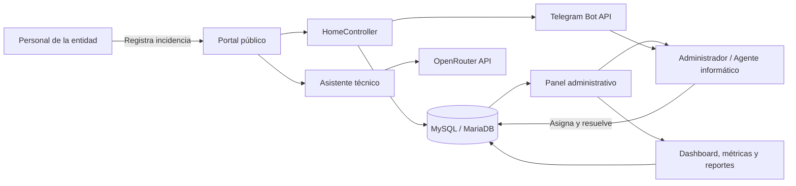
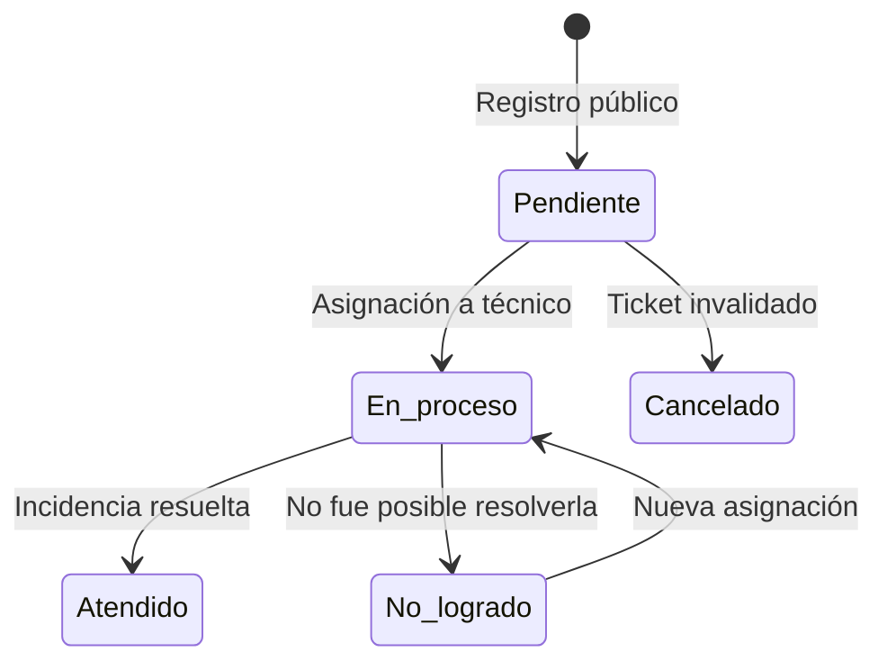

# GR-Tickets (ITIMS)


**GR-Tickets** es un sistema web para gestionar incidencias y actividades de soporte técnico en el Gobierno Regional de Apurímac. Permite registrar solicitudes desde un portal público, asignarlas al equipo de informática, realizar su seguimiento, documentar la solución y analizar el servicio mediante indicadores y reportes.

El proyecto también se denomina **ITIMS — Intelligent Technical Incident Management System** y forma parte del trabajo _Design and Implementation of an AI-Assisted Ticketing System for Public-Sector Incident Management_.

## Contenido

- [Características principales](#características-principales)
- [Arquitectura](#arquitectura)
- [Flujo de un ticket](#flujo-de-un-ticket)
- [Tecnologías](#tecnologías)
- [Requisitos](#requisitos)
- [Instalación](#instalación)
- [Configuración](#configuración)
- [Chatbot con OpenRouter](#chatbot-con-openrouter)
- [Notificaciones con Telegram](#notificaciones-con-telegram)
- [Dashboard y métricas](#dashboard-y-métricas)
- [Bitácora de trabajo](#bitácora-de-trabajo)
- [Estructura del proyecto](#estructura-del-proyecto)
- [Pruebas](#pruebas)
- [Seguridad y despliegue](#seguridad-y-despliegue)
- [Documentación técnica](#documentación-técnica)
- [Licencia](#licencia)

## Características principales

- Registro público de tickets mediante DNI, oficina y tipo de incidencia.
- Consulta del seguimiento utilizando DNI o código de ticket.
- Archivos adjuntos para evidencias en JPG, JPEG, PNG o PDF.
- Gestión del ciclo de vida de tickets: pendiente, en proceso, atendido, no logrado y cancelado.
- Asignación de tickets a técnicos con control FIFO para priorizar las solicitudes más antiguas.
- Gestión de oficinas jerárquicas, personal, usuarios de informática, incidencias y regímenes laborales.
- Generación de reportes técnicos en PDF.
- Bitácora para registrar mantenimiento, tareas administrativas y actividades internas del área de informática.
- Dashboard administrativo con KPIs, gráficos, tablas y filtro general por rango de fechas.
- Asistente técnico virtual conectado a OpenRouter con modelos alternativos de respaldo.
- Notificaciones y asignación de tickets mediante Telegram.
- Métricas de uso del chatbot y apertura de notificaciones.
- Control de acceso según el tipo de usuario.

## Arquitectura

La aplicación utiliza el patrón **Modelo–Vista–Controlador (MVC)** de Laravel. El portal público y el panel administrativo comparten la misma base de datos, pero tienen flujos y permisos diferentes.



### Áreas funcionales

| Área | Responsabilidad |
|---|---|
| Portal público | Registro y consulta de tickets sin iniciar sesión. |
| Gestión de tickets | Asignación, atención, finalización, cancelación y reportes PDF. |
| Administración | Gestión de oficinas, personal, usuarios, incidencias y datos institucionales. |
| Dashboard | Indicadores, tiempos promedio, gráficos históricos y tablas filtrables. |
| Bitácora | Registro de actividades internas independientes de los tickets públicos. |
| Chatbot | Orientación técnica de primer nivel y recomendación de crear tickets. |
| Telegram | Alertas móviles, consulta de pendientes y asignación de tickets. |

## Flujo de un ticket



| Código | Estado | Descripción |
|---:|---|---|
| 1 | Pendiente | Ticket registrado y pendiente de asignación. |
| 2 | En proceso | Un técnico está atendiendo la incidencia. |
| 3 | Atendido | Incidencia resuelta correctamente. |
| 4 | No logrado | La atención no pudo completarse. |
| 5 | Cancelado | Ticket anulado o descartado. |

Las entidades principales utilizan identificadores personalizados como `tik0001`, `ofi0001`, `usu0001` y `not0001`.

## Tecnologías

| Componente | Tecnología |
|---|---|
| Backend | PHP 8.2+, Laravel 10 |
| Frontend | Blade, Bootstrap y tema Hyper |
| Base de datos | MySQL o MariaDB |
| Gráficos | ApexCharts |
| Tablas | DataTables |
| IA | OpenRouter API |
| Mensajería | Telegram Bot API |
| PDF | `barryvdh/laravel-dompdf` |
| Recursos frontend | Vite 4, Axios |
| Pruebas | PHPUnit 10 |

## Requisitos

- PHP **8.2 o superior**.
- Composer.
- MySQL o MariaDB.
- Node.js y npm.
- Apache, Nginx o el servidor de desarrollo de Laravel.
- Extensiones de PHP requeridas por Laravel y PDO MySQL.
- Una API key de OpenRouter para habilitar el chatbot.
- Un bot de Telegram para habilitar las notificaciones móviles.

Para desarrollo en Windows puede utilizarse **XAMPP**.

## Instalación

1. Clonar el repositorio:

   ```bash
   git clone https://github.com/AlbertPF/tickets.git
   cd tickets
   ```

2. Instalar las dependencias de PHP y JavaScript:

   ```bash
   composer install
   npm install
   ```

3. Crear el archivo de entorno:

   ```bash
   cp .env.example .env
   ```

   En PowerShell:

   ```powershell
   Copy-Item .env.example .env
   ```

4. Generar la clave de la aplicación:

   ```bash
   php artisan key:generate
   ```

5. Configurar la conexión a la base de datos en `.env` y ejecutar:

   ```bash
   php artisan migrate --seed
   php artisan storage:link
   ```

6. Compilar los recursos frontend:

   ```bash
   npm run build
   ```

7. Iniciar el servidor local:

   ```bash
   php artisan serve
   ```

   La aplicación estará disponible normalmente en `http://127.0.0.1:8000`.

Para trabajar con recarga automática del frontend, ejecute `npm run dev` en otra terminal.

### Usuario inicial

El seeder crea una cuenta administrativa para desarrollo:

| Campo | Valor |
|---|---|
| Usuario | `Admin` |
| Contraseña | `Admin2024.` |

> Cambie estas credenciales inmediatamente fuera de un entorno local.

## Configuración

Ejemplo de las variables principales:

```dotenv
APP_NAME="GR-Tickets"
APP_ENV=local
APP_DEBUG=true
APP_URL=http://127.0.0.1:8000

DB_CONNECTION=mysql
DB_HOST=127.0.0.1
DB_PORT=3306
DB_DATABASE=tickets
DB_USERNAME=root
DB_PASSWORD=

SESSION_DRIVER=file
SESSION_LIFETIME=120

OPENROUTER_API_KEY=
OPENROUTER_PRIMARY_MODEL=nvidia/nemotron-3-super-120b-a12b:free
OPENROUTER_MAX_TOKENS=2048

TELEGRAM_BOT_TOKEN=
```

Después de modificar `.env`, limpie la configuración almacenada:

```bash
php artisan optimize:clear
```

En producción utilice `APP_ENV=production`, desactive `APP_DEBUG` y configure `APP_URL` con el dominio HTTPS real.

## Chatbot con OpenRouter

El asistente técnico virtual atiende consultas informáticas de primer nivel. Su comportamiento se controla mediante el prompt ubicado en:

```text
storage/app/prompts/system_prompt.txt
```

La integración:

- Utiliza `OPENROUTER_API_KEY` para autenticarse.
- Permite seleccionar el modelo principal con `OPENROUTER_PRIMARY_MODEL`.
- Limita la respuesta mediante `OPENROUTER_MAX_TOKENS`.
- Continúa con modelos de respaldo ante errores recuperables o límites de uso.
- Registra interacciones, mensajes, respuestas exitosas, errores y modelo utilizado.
- Expone métricas históricas en el dashboard administrativo.

Los modelos gratuitos pueden cambiar de disponibilidad. La cadena vigente se configura en `config/services.php`.

## Notificaciones con Telegram

Telegram permite notificar al equipo técnico cuando se registra un ticket y gestionar acciones desde el teléfono.

### Funciones disponibles

- `/pendientes [cantidad]`: muestra tickets pendientes.
- `/asignar <id_ticket>`: asigna un ticket al técnico asociado con ese Telegram.
- `/ayuda`: muestra los comandos disponibles.
- Botones para abrir o asignar tickets desde la notificación.
- Seguimiento de notificaciones enviadas, abiertas y tiempos de apertura.

Cada usuario técnico debe tener registrado su `telegram_user_id` en la base de datos.

### Configurar el webhook

La aplicación recibe actualizaciones en:

```text
POST /api/telegram/webhook
```

Con una URL pública HTTPS puede registrarse el webhook de esta manera:

```bash
curl -X POST "https://api.telegram.org/bot<TOKEN>/setWebhook" \
  -d "url=https://su-dominio.gob.pe/api/telegram/webhook"
```

No exponga `TELEGRAM_BOT_TOKEN` en el repositorio ni en capturas de pantalla.

## Dashboard y métricas

El panel administrativo incluye:

- Cantidad de tickets, oficinas, personal y usuarios de informática.
- Tickets por estado y categoría de soporte.
- Tickets atendidos por técnico.
- Tendencia diaria y oficinas con más solicitudes.
- Tiempo promedio hasta la primera asignación.
- Tiempo promedio de resolución de incidencias.
- Métricas del chatbot: interacciones, mensajes, respuestas exitosas y tasa de éxito.
- Métricas de Telegram: tasa de apertura, notificaciones no abiertas, tiempo promedio y usuarios inactivos.
- Tabla de asignaciones con filtros por técnico, usuario, incidencia, oficina y palabra clave.

El filtro general de fechas actualiza tarjetas, gráficos, métricas y tablas para consultar periodos históricos.

## Bitácora de trabajo

La bitácora registra actividades internas que no necesariamente nacen de un ticket público, por ejemplo mantenimiento, actualización de sistemas o labores administrativas.

Sus estados son:

1. Pendiente.
2. En proceso.
3. Finalizado.

Los administradores pueden filtrar actividades por usuario, oficina y rango de fechas para revisar el trabajo del equipo.

## Estructura del proyecto

```text
app/
├── Http/Controllers/     # Lógica del portal, administración e integraciones
├── Http/Middleware/      # Autenticación y control de acceso
├── Jobs/                 # Procesos programados
├── Models/               # Entidades Eloquent
└── Support/              # Utilidades compartidas
config/                   # Configuración de servicios y aplicación
database/
├── migrations/           # Esquema de base de datos
└── seeders/              # Datos iniciales
resources/views/          # Vistas Blade públicas y administrativas
routes/
├── web.php               # Portal y panel administrativo
└── api.php               # Chatbot y webhook de Telegram
storage/app/prompts/      # Prompt del asistente técnico
tests/                    # Pruebas unitarias y funcionales
```

## Pruebas

Ejecutar la suite automatizada:

```bash
php artisan test
```

Validar la compilación frontend:

```bash
npm run build
```

Las pruebas actuales verifican, entre otros puntos, la validación de rangos del dashboard y el mecanismo de respaldo de modelos de OpenRouter.

## Seguridad y despliegue

- No suba `.env`, tokens, contraseñas ni claves API al repositorio.
- Utilice HTTPS para Telegram y para el entorno de producción.
- Mantenga `APP_DEBUG=false` en producción.
- Cambie las credenciales creadas por los seeders.
- Sirva la aplicación desde el directorio `public/`.
- Configure permisos de escritura para `storage/` y `bootstrap/cache/`.
- Ejecute `php artisan config:cache` después de configurar el entorno de producción.

## Documentación técnica

La documentación navegable del código se encuentra en:

- [DeepWiki — AlbertPF/tickets](https://deepwiki.com/AlbertPF/tickets)

## Licencia

Este proyecto se distribuye bajo la licencia MIT.

## Citación

Si utiliza este sistema en un trabajo académico o de investigación, cite el estudio:

> _Design and Implementation of an AI-Assisted Ticketing System for Public-Sector Incident Management._
